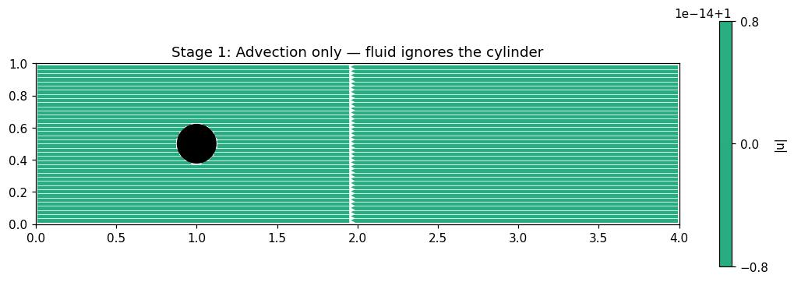
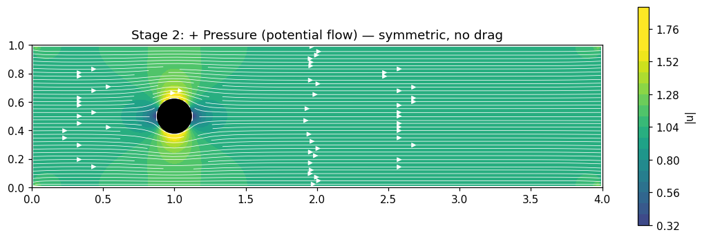
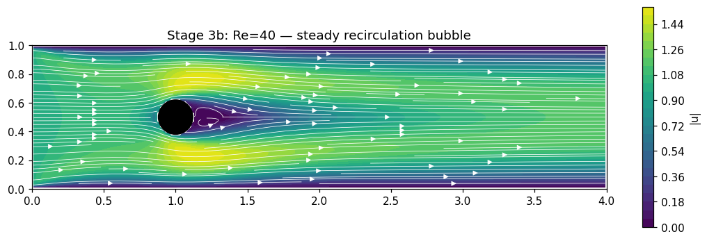
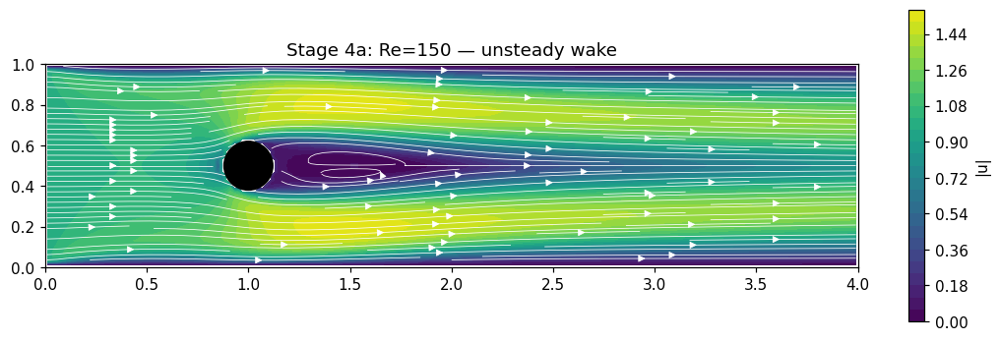
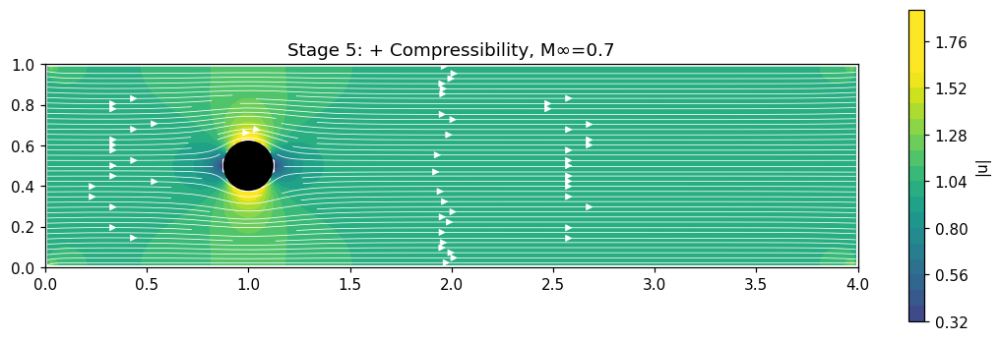

# Navier–Stokes, One Term at a Time

If you've only seen the Navier–Stokes equations as a single intimidating block on a slide, they look like something handed down from on high. They aren't. They're what you get when you start from Newton's second law, apply it to a parcel of fluid, and then refuse to make assumptions you can't justify. Every term is there because you put it there.

This post walks through the build-up. One equation, one term at a time, each stage showing what the new term actually *does* to a concrete problem: 2D flow past a circular cylinder in a channel, uniform inflow from the left.

## Stage 1: Newton's second law on a fluid parcel

Pick a small blob of fluid. Track it. Apply $F = ma$ per unit volume:

$$\rho \left( \frac{\partial \mathbf{u}}{\partial t} + (\mathbf{u}\cdot\nabla)\mathbf{u} \right) = \mathbf{f}$$

The left side is acceleration of the parcel. The first term is the local rate of change at a fixed point in space; the second term accounts for the fact that the parcel is also moving *into* regions with different velocity. That second term, $(\mathbf{u}\cdot\nabla)\mathbf{u}$, is the nonlinear convective term — the one responsible for essentially everything interesting in fluid dynamics.

With no forces on the right, the fluid just coasts. Drop it into our cylinder problem with uniform inflow and you get: uniform flow. The cylinder is there, but the fluid has no mechanism to feel it. Nothing deflects. The obstacle is invisible.

This is the pedagogical baseline. Look at what's missing.

## Stage 2: Add pressure

Fluid at the front of the cylinder can't keep going forward — there's no room. Something has to push it sideways. That something is pressure, a scalar field that pushes along its negative gradient:

$$\rho \left( \frac{\partial \mathbf{u}}{\partial t} + (\mathbf{u}\cdot\nabla)\mathbf{u} \right) = -\nabla p$$

This is the **Euler equation**. It's what you'd use for an ideal fluid with no internal friction. To close the system, we also need mass conservation — incompressible for now:

$$\nabla \cdot \mathbf{u} = 0$$

Now the fluid knows the cylinder is there. It bulges around it, accelerates over the top and bottom (Bernoulli: faster flow, lower pressure), and recovers on the far side. The picture is perfectly symmetric front-to-back. Integrating pressure around the cylinder gives zero drag — d'Alembert's paradox. An inviscid fluid exerts no drag on an obstacle, which we know is wrong for every fluid you've ever touched.

Something is still missing.

## Stage 3: Add viscosity

Real fluids resist *shear*. Neighboring layers moving at different speeds drag on each other. Model that drag as proportional to velocity gradients (Newtonian fluid, one free parameter $\mu$), and the momentum equation gains a Laplacian term:

$$\rho \left( \frac{\partial \mathbf{u}}{\partial t} + (\mathbf{u}\cdot\nabla)\mathbf{u} \right) = -\nabla p + \mu \nabla^2 \mathbf{u}, \qquad \nabla \cdot \mathbf{u} = 0$$

This is the **incompressible Navier–Stokes system**. Four equations (three components of momentum plus divergence-free constraint), four unknowns ($\mathbf{u}$ and $p$). Closed.

Viscosity does two things. First, it enforces **no-slip** at solid boundaries — the fluid in direct contact with the cylinder has the cylinder's velocity, which is zero. This creates a boundary layer where velocity ramps up from 0 to the free-stream value. Second, it dissipates kinetic energy: moving fluid in the wake is irrecoverably lost, which is what drag actually *is*.

At Reynolds number $Re = UL/\nu \approx 40$, a standing pair of recirculation vortices appears behind the cylinder. The front-back symmetry is broken. Pressure recovers less on the downstream side. That asymmetry is the drag force, and this time it isn't zero.

## Stage 4: Same equations, higher Re

Drop viscosity further, so $Re \approx 150$. The equations are identical to Stage 3. Only the coefficient changed. And the behavior changes qualitatively: the wake becomes unsteady, vortices begin to shed alternately from the top and bottom of the cylinder, and the flow is no longer symmetric about the centerline even in a time-averaged sense.

Nothing new was added to the equations. This is purely the nonlinear term $(\mathbf{u}\cdot\nabla)\mathbf{u}$ asserting itself: it couples scales, it destabilizes steady solutions, and at high enough Reynolds numbers it produces the full mess we call turbulence. Same PDE, different parameter, different universe.

If you're used to linear models, this is the sharpest lesson in the post. Linear systems scale predictably. The Navier–Stokes system does not. Doubling the inflow velocity doesn't double the answer — past a threshold, it *changes what kind of answer exists*.

## Stage 5: Relax incompressibility

So far we've held density constant. Relax that:

$$\frac{\partial \rho}{\partial t} + \nabla \cdot (\rho \mathbf{u}) = 0$$
$$\rho \left( \frac{\partial \mathbf{u}}{\partial t} + (\mathbf{u}\cdot\nabla)\mathbf{u} \right) = -\nabla p + \nabla \cdot \boldsymbol{\tau}$$
$$p = p(\rho, T)$$

Now $\rho$ is a field with its own evolution equation (continuity). We need an equation of state tying pressure to density and temperature, and strictly we'd add an energy equation too. The viscous stress generalizes to a tensor $\boldsymbol{\tau}$ that accounts for bulk expansion.

The mathematical character of the problem changes here, and this is the part worth dwelling on if you come from a CS background. In the incompressible case, pressure has no time derivative — it's a Lagrange multiplier that instantaneously enforces $\nabla \cdot \mathbf{u} = 0$. A pressure disturbance propagates everywhere at infinite speed. The system is elliptic in pressure.

In the compressible case, pressure is coupled to $\rho$ through the equation of state, and $\rho$ evolves in time. Disturbances now propagate at a finite speed — the speed of sound. The system becomes **hyperbolic**. Shocks become possible. Sound waves exist. None of this is available in the incompressible world.

For flows well below the speed of sound — water through a pipe, air over a slow object — density changes are negligible ($\mathcal{O}(M^2)$ where $M$ is the Mach number) and the incompressible equations are exact enough. For transonic or supersonic flows, you have no choice but to use the full compressible system.

## What we just did

We started with $F = ma$ on a fluid parcel. Each stage added a single term by asking "what did I just assume, and what happens if I don't?"

| Stage | Added | Unlocked |
|---|---|---|
| 1 | — | Nothing — fluid ignores the cylinder |
| 2 | $-\nabla p$ | Deflection, Bernoulli, d'Alembert's paradox |
| 3 | $\mu \nabla^2 \mathbf{u}$ | No-slip, boundary layers, drag |
| 4 | (same eqs., smaller $\nu$) | Instability, vortex shedding, turbulence |
| 5 | $\partial_t \rho + \nabla\cdot(\rho\mathbf{u}) = 0$, EOS | Sound waves, shocks, hyperbolic character |

Each of those "unlocks" is a real physical phenomenon that would be *invisible* in the previous stage's equations — not approximated badly, but literally absent. The equations don't have a knob for "drag" or "shedding" or "shocks." Those emerge from adding the right term and turning the right coefficient.

That's the thing I find beautiful about the Navier–Stokes system, and the thing I think is easy to miss when you first see it written down: it's not a model of fluids. It's what you get when you refuse to pretend anything you don't have to.

---

*If you want to play with the cylinder problem yourself, there's an interactive widget below — toggle pressure, viscosity, and compressibility to see the stages in real time.*

*[widget embed goes here]*
